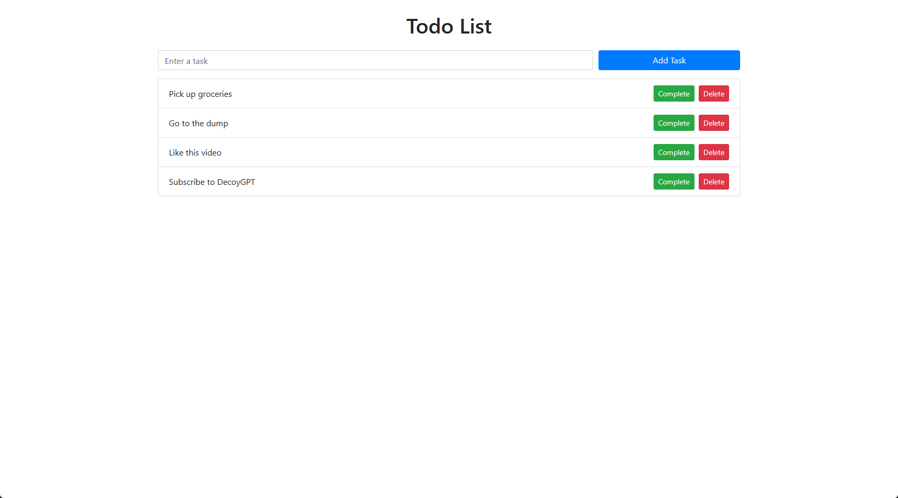

# ToDo List App

This is a simple ToDo List application built using HTML, Bootstrap, and JavaScript. The app allows you to add, update, and remove tasks dynamically. It also features filtering tasks, marking them as completed, and persisting the data using local storage.

## Features

- Add new tasks and manage your ToDo list
- Update and remove tasks dynamically
- Filter tasks based on their status (completed, active, all)
- Mark tasks as completed
- Persist data using local storage

## Usage

Simply open the `index.html` file in a web browser to start using the ToDo List app. You can add tasks using the input field at the top and manage your tasks using the buttons provided. The task list is automatically saved and retrieved from the local storage.

## YouTube Tutorial

Check out the tutorial on YouTube: [Link to Your YouTube Video](https://youtube.com/your-video-link)

## Contributing

Contributions are welcome! If you have any ideas, suggestions, or improvements, feel free to submit a pull request.

## License

This project is licensed under the [MIT License](LICENSE).

## Acknowledgements

- The design and functionality of this ToDo List app were inspired by various online resources and tutorials.
